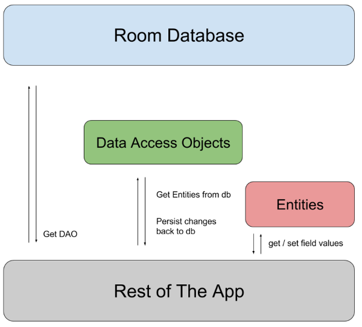

---

# Structured data
* Relational DB
* User input
* Backend requests
* SQLite vs. Room

---

# SQLite
* Powerful, low-level API
* No compile-time query checks
* Lots of boilerplate

---

# Room :rocket:
* Uses SQLite
* Abstraction layer on top
* Annotations
* Compile-time query checks
* Observable queries
* No blocking the main thread
* Easy testing

---

# Components
* Entities
* DAOs
* Database

---
<!--_backgroundColor: white-->

